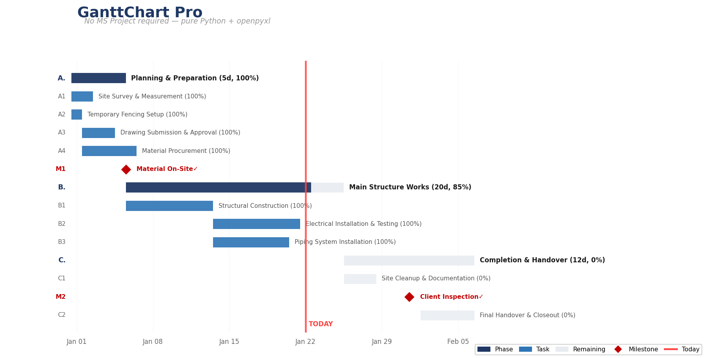

<p align="center">
  
  
  
</p>

# GanttChart Pro

> **Professional Gantt charts in Excel — no MS Project required.**

Generate beautiful, print-ready construction schedules with pure Python + openpyxl. Dual calendar modes, WBS auto-grouping, milestone markers, dependency arrows, and three-level timescale — everything you'd expect from MS Project, without the license or complexity.

<p align="center">
  
</p>

---

## 🎯 Why GanttChart Pro?

| | MS Project | GanttChart Pro |
|---|---|---|
| **Cost** | $$$ license | Free (MIT) |
| **Setup** | Complex install | `pip install openpyxl` |
| **Sharing** | .mpp files only | .xlsx (anyone can open) |
| **Automation** | COM hack | Native Python API |
| **Cross-platform** | Windows only | Windows / macOS / Linux |

---

## 🚀 Quick Start

```bash
git clone https://github.com/David-CB666/gantt-chart-pro.git
cd gantt-chart-pro
pip install openpyxl
```

### Generate a Chart (one command)

```bash
python scripts/gantt_chart_pro.py --input examples/EDF.xlsx --output schedule.xlsx --scheme blue_pro
```

### From Python

```python
from scripts.gantt_chart_pro import GanttGenerator

gen = GanttGenerator(
    input_file="examples/EDF.xlsx",
    output_file="schedule.xlsx",
    color_scheme="blue_pro",
    calendar_mode="calendar_days"
)
gen.generate()
```

---

## 📊 Features

- 🗓️ **Dual calendar modes** — calendar days or working days
- 🎨 **Multiple color schemes** — blue_pro, green_calm, gray_minimal
- 📊 **WBS auto-grouping** — task codes define hierarchy (A=Level 1, A1=Level 2)
- 🚩 **Milestone markers** — auto-detected or manual
- 📏 **Weekend highlight** — gray background for non-working days
- 🔴 **Today line** — red vertical line at current date
- 🔗 **Dependency arrows** — FS/SS/FF/SF relationships
- 📐 **Three-level timescale** — year / month / day
- 🖨️ **Print-ready** — landscape, auto-fit, repeating headers

---

## 📋 EDF Data Format

Prepare an Excel file with these columns:

| Column | Required | Description |
|--------|----------|-------------|
| **Task ID** | Recommended | A, A1, A2... (auto-infers hierarchy) |
| **Task Name** | Yes | Description |
| **Start Date** | Yes | YYYY-MM-DD |
| **Duration** | No | Days (default: 1) |
| **End Date** | No | Auto-calculated |
| **Predecessor** | No | e.g. "A1FS" or "A1" |

See [`examples/EDF.xlsx`](examples/EDF.xlsx) for a working example.

---

## 🎨 Color Schemes

| Scheme | Vibe | Best For |
|--------|------|----------|
| `blue_pro` | Professional navy | Client presentations |
| `green_calm` | Soft green | Internal planning |
| `gray_minimal` | Clean grayscale | Print/black & white |

Full customization: [`gantt_styles.json`](gantt_styles.json)

---

## 📊 Real-World Impact

> *"以前出甘特圖要用 MS Project，授權貴、同事開唔到 .mpp。而家 Excel 一開就得，業主、顧問、判頭全部睇到。改圖仲快過 MSP 10 倍。"* — Mike, MEP Project Manager

---

## 🇭🇰 中文簡介

純 Python + Excel 甘特圖生成器。支援雙日曆模式、WBS 任務自動分組、里程碑標記、前置任務箭嘴、三層時間軸。唔洗 MS Project，出到專業施工進度圖。

---

## 📖 Documentation

- **Configuration Guide**: [`references/config-guide.md`](references/config-guide.md)
- **Color Scheme Reference**: [`references/color-schemes.md`](references/color-schemes.md)

---

## 🔗 My Other Tools

| Tool | Description |
|------|-------------|
| [**Excel Template Filler**](https://github.com/David-CB666/excel-template-filler) | Dual-engine batch template filling — images & print settings preserved |
| [**VBA Macro Reader**](https://github.com/David-CB666/VBA-Macro-Reader-v2.0.0) | Read, modify & execute VBA macros from .xlsm files |
| [**Material Submittal Generator**](https://github.com/David-CB666/material-submittal-generator) | One-click batch submittals + auto BQ page merging |

---

## 📄 License

MIT © [David-CB666](https://github.com/David-CB666)
