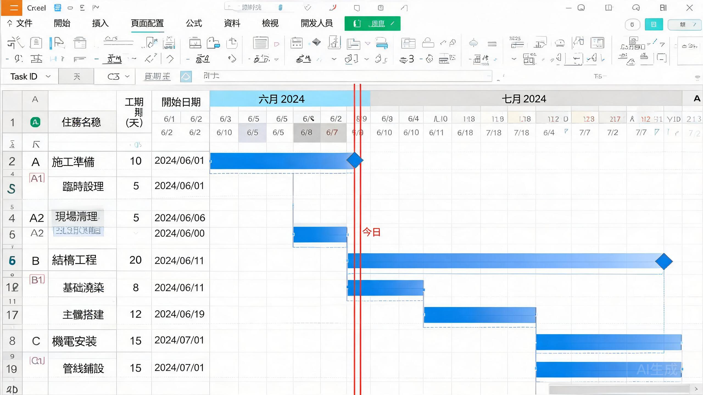

<div align="center">

# GanttChart Pro

### Professional Gantt charts in Excel — no MS Project required.

Generate beautiful, print-ready construction schedules with pure Python + openpyxl. Dual calendar modes, WBS auto-grouping, milestone markers, dependency arrows, and three-level timescale — everything you'd expect from MS Project, without the license or complexity.

[](https://opensource.org/licenses/MIT)
[](https://python.org)
[](https://openpyxl.readthedocs.io)
[](https://github.com/David-CB666/gantt-chart-pro/stargazers)
[](https://github.com/David-CB666/gantt-chart-pro/network/members)
[](https://github.com/David-CB666/gantt-chart-pro/commits)

[Quick Start](#-quick-start) · [Features](#-features) · [Documentation](#-documentation) · [中文介绍](#-中文介绍)

</div>

---

## 📸 Demo



*Professional Gantt chart generated in Excel — WBS grouping, milestones, weekend shading, dual calendar*

## 🎯 Why GanttChart Pro?

**MS Project costs hundreds of dollars, only runs on Windows, and outputs `.mpp` files that nobody else can open. GanttChart Pro generates the same professional Gantt charts directly in Excel — free, cross-platform, and universally shareable.**

| Feature | MS Project | GanttChart Pro |
|---------|-----------|----------------|
| **Cost** | $$$ license | **Free (MIT)** |
| **Setup** | Complex install | `pip install openpyxl` |
| **Sharing** | .mpp files only | **.xlsx (anyone can open)** |
| **Automation** | COM hack | **Native Python API** |
| **Cross-platform** | Windows only | **Win / macOS / Linux** |
| **Output format** | .mpp (proprietary) | **.xlsx (universal)** |

## 🚀 Quick Start

```bash
git clone https://github.com/David-CB666/gantt-chart-pro.git
cd gantt-chart-pro
pip install openpyxl
```

### Generate a Chart (one command)

```bash
# JSON config mode (recommended)
python scripts/gen_gantt.py scripts/gantt_config.example.json output.xlsx

# EDF Excel import mode
python scripts/gen_gantt.py examples/EDF.example.xlsx output.xlsx

# GUI mode (interactive panel)
python scripts/gen_gantt.py
```

### From Python

```python
import sys, os
sys.path.insert(0, os.path.join(os.path.dirname(__file__), "scripts"))
from gen_gantt import GanttChart

chart = GanttChart(config_path="scripts/gantt_config.example.json")
chart.render(output_path="schedule.xlsx")
```

## 📊 Features

| Feature | Description |
|---------|-------------|
| 🗓️ **Dual calendar modes** | Calendar days or working days |
| 🎨 **Multiple color schemes** | `blue_pro`, `green_calm`, `gray_minimal` |
| 📊 **WBS auto-grouping** | Task codes define hierarchy (A=Level 1, A1=Level 2) |
| 🚩 **Milestone markers** | Auto-detected or manual |
| 📏 **Weekend highlight** | Gray background for non-working days |
| 🔴 **Today line** | Red vertical line at current date |
| 🔗 **Dependency arrows** | FS/SS/FF/SF relationships |
| 📐 **Three-level timescale** | Year / Month / Day |
| 🖨️ **Print-ready** | Landscape, auto-fit, repeating headers |

## 📋 EDF Data Format

Prepare an Excel file with these columns:

| Column | Required | Description |
|--------|----------|-------------|
| **Task ID** | Recommended | A, A1, A2... (auto-infers hierarchy) |
| **Task Name** | Yes | Description |
| **Start Date** | Yes | YYYY-MM-DD |
| **Duration** | No | Days (default: 1) |
| **End Date** | No | Auto-calculated |
| **Predecessor** | No | e.g. "A1FS" or "A1" |

See [`examples/EDF.example.xlsx`](examples/EDF.example.xlsx) for a working example.

## 🎨 Color Schemes

| Scheme | Vibe | Best For |
|--------|------|----------|
| `blue_pro` | Professional navy | Client presentations |
| `green_calm` | Soft green | Internal planning |
| `gray_minimal` | Clean grayscale | Print / black & white |

Full customization: [`scripts/gantt_styles.json`](scripts/gantt_styles.json)

## 📖 Documentation

| Document | Description |
|----------|-------------|
| [Configuration Guide](references/config-guide.md) | Detailed setup and configuration options |
| [Color Scheme Reference](references/color-schemes.md) | All available color schemes and customization |

## 📊 Real-World Impact

> *"以前出甘特图要用 MS Project，授权贵、同事打不开 .mpp。现在 Excel 一开就行，业主、顾问、分包商全部能看到。改图还比 MSP 快 10 倍。"*
> — Mike, MEP Project Manager

| Metric | Before (MS Project) | After (GanttChart Pro) |
|--------|--------------------|-----------------------|
| Software cost | $$$ per user | **Free** |
| File sharing | Only MS Project users | **Anyone with Excel** |
| Update speed | 30+ min per revision | **3 min** |
| Platform | Windows only | **Any OS** |

## 🇨🇳 中文介绍

纯 Python + Excel 甘特图生成器。支持双日历模式（日历日/工作日）、WBS 任务自动分组、里程碑标记、前置任务箭头（FS/SS/FF/SF）、三层层级时间轴、周末高亮、今日红线。无需 MS Project，直接输出专业施工进度图。

**核心优势：**
- 免费（MIT 协议），不限用户数
- 输出标准 `.xlsx` 格式，所有人都能打开
- 纯 Python 实现，跨平台运行
- 内置 3 套配色方案，支持完全自定义

## 📖 Complete Guide

This tool is a practical output from the **AI Agent Cultivation Field Manual v2.0** — a 13-chapter handbook that teaches you how to train AI to handle real engineering documentation workflows.

**The manual covers the full pipeline:**

| Software | Manual Chapter | Efficiency Gain |
|----------|---------------|-----------------|
| Word | Ch.6 | 2-3 days → 30 min |
| **Excel** ← this tool's domain | Ch.7 | 14 hrs → 30 min |
| PDF | Ch.8 | 200 pages → 40 min |
| CAD | Ch.9 | 30 min/sheet → minutes/set |

**What you get with the full version:**
- 13 chapters + 8 appendices (HTML + PDF + EPUB)
- 7 installable skill packs — plug and play
- Complete Python case studies (safe_convert, SLD parser, material submittal pipeline)
- 128 days of real AI cultivation records — pitfalls, rules, breakthroughs

👉 **[Get the full manual →](https://david-cb666.github.io/ai-agent-manual)**

> Free preview: Chapter 1 (5-min AI level self-assessment) available on the landing page.

---

## 🔗 My Other Tools

| Tool | Description |
|------|-------------|
| [**Excel Template Filler**](https://github.com/David-CB666/excel-template-filler) | Dual-engine batch template filling — images & print settings preserved |
| [**VBA Macro Reader**](https://github.com/David-CB666/VBA-Macro-Reader-v2.0.0) | Read, modify & execute VBA macros from .xlsm files |
| [**Material Submittal Generator**](https://github.com/David-CB666/material-submittal-generator) | One-click batch submittals + auto BQ page merging |

## 🤝 Contributing

Contributions are welcome! Please read the [Contributing Guide](CONTRIBUTING.md) before submitting a pull request.

## 📄 License

MIT © [David-CB666](https://github.com/David-CB666)

---

<div align="center">

### ⭐ If this tool saved you time, give it a star!

[](https://star-history.com/#David-CB666/gantt-chart-pro&Date)

</div>
